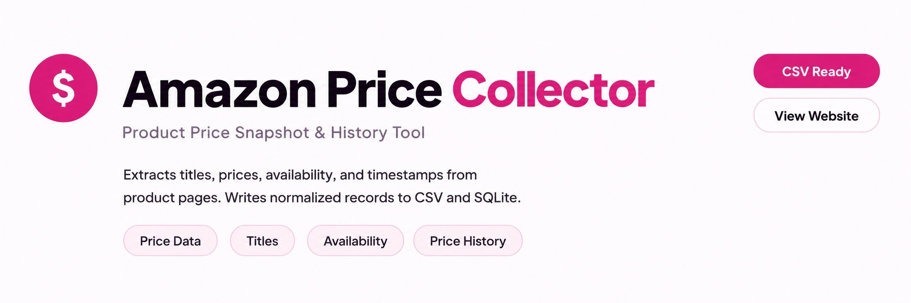
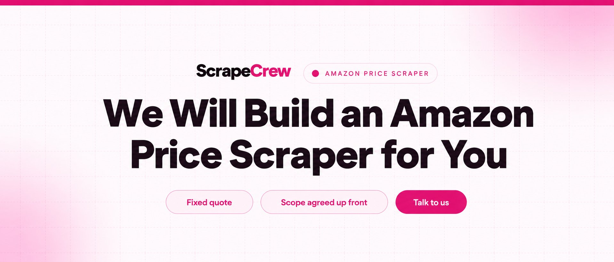
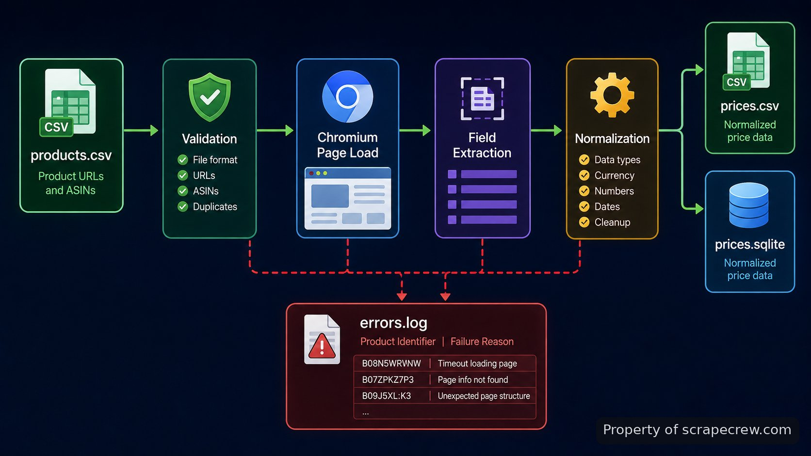

<p align="center">
  <a href="https://www.scrapecrew.com" target="_blank" rel="nofollow">
    
  </a>
</p>

<p align="center">
  <a href="https://t.me/Bitbash333" target="_blank" rel="nofollow">
    
  </a>&nbsp;
  <a href="https://wa.me/923249868488?text=Hi%2C%20I%27m%20interested." target="_blank" rel="nofollow">
    
  </a>&nbsp;
  <a href="mailto:hello@scrapecrew.com" target="_blank" rel="nofollow">
    
  </a>&nbsp;
  <a href="https://www.scrapecrew.com" target="_blank" rel="nofollow">
    
  </a>
</p>

## amazon price scraper

The **amazon price scraper** is a command-line tool for turning a list of Amazon product pages into repeatable price snapshots. It accepts product URLs or ASIN-based inputs, opens each listing in a real browser session, extracts the current displayed price and a small set of identifying fields, then writes normalized records to CSV and SQLite. The repository is meant for operators who need the same collection path on every run rather than a one-off copy-and-paste pass.

The important boundary is simple: this repository records what a product page exposes at collection time. It does not forecast prices, place orders, sign into customer accounts, or bypass access controls. A failed parse stays visible as a failed row instead of being silently converted into an empty price, which makes downstream comparisons easier to trust.

<a href="https://www.scrapecrew.com" target="_blank" rel="nofollow">
  
</a>

<a href="https://tally.so/r/BzWjZQ?platform=GitHub&amp;format=Product+repo&amp;brand=ScrapeCrew&amp;niche=scraping&amp;page=Amazon+Price+Scraper+using+Playwright&amp;date=2026-08-26" target="_blank" rel="nofollow">
  
</a>

## Workflow from product list to stored snapshot

Each run follows one linear pipeline. The loader reads `data/products.csv`, validates the URL or ASIN, and creates a canonical product target. A Chromium page is then opened through <a href="https://playwright.dev/python/docs/library" target="_blank" rel="nofollow">Playwright for Python</a>. The collector waits for the listing to reach a usable DOM state, captures the supported fields, and hands the result to a normalizer that removes presentation-only formatting while preserving the original text alongside parsed values.

Successful and failed targets both reach storage. CSV is the portable export for spreadsheets and ad-hoc analysis; SQLite keeps a durable history keyed by product and collection timestamp. That separation matters when Amazon changes markup: extraction can fail for one target without corrupting earlier observations or making the whole batch look successful.



## Core Features

| Feature | Description |
| --- | --- |
| URL and ASIN input | Manual reformatting is avoided by accepting either a full listing URL or an ASIN-based target and resolving both into the same internal product record. |
| Browser-rendered collection | Prices hidden behind browser-side rendering are handled by loading the listing through Chromium instead of assuming the first HTTP response contains every visible field. |
| Normalized price record | Inconsistent display text is kept from leaking into analysis by storing both the captured text and a parsed numeric field when parsing succeeds. |
| Timestamped SQLite history | A new scrape does not overwrite the previous observation; each successful collection is stored with its run timestamp for later comparison. |
| CSV export | Spreadsheet work does not require querying the database. The run also writes a flat file using Python's documented <a href="https://docs.python.org/3/library/csv.html" target="_blank" rel="nofollow">CSV support</a>. |
| Explicit failure rows | Blocked, missing, or structurally changed pages are not disguised as zero values. The run records the target and failure reason for review. |

The feature set stays intentionally narrow. There is no checkout automation, seller-account workflow, repricing action, or alerting channel in this repository. Its job ends when the page observation has been captured, normalized, and written.

## Inputs and output schema

The default input is a CSV file with `url` and optional `label` columns. A direct `/dp/ASIN` URL is easiest to audit because the target is visible in the file, while the label lets a human keep an internal name without changing the scraped record. Duplicate targets are collapsed within one run so the same page is not opened twice accidentally.

```csv
url,label
https://www.amazon.com/dp/B08N5WRWNW,reference-device
https://www.amazon.com/dp/B09B8V1LZ3,second-device
```

| Output field | Meaning |
| --- | --- |
| product_id | Canonical ASIN or product identifier resolved from the input target. |
| title | Listing title captured from the rendered page. |
| price_text | Displayed price text exactly as collected before numeric parsing. |
| price_value | Parsed numeric value when the captured format can be normalized safely. |
| availability | Availability text when the listing exposes it in the supported layout. |
| source_url | Canonical page used for the observation. |
| collected_at | UTC timestamp attached when the observation is written. |
| status | Success or explicit failure state for the target. |

A row with `status=failed` is still useful evidence: it tells downstream code that a collection attempt happened but did not yield a trustworthy observation. That is materially different from a genuine displayed zero or a missing historical row.

## Technical stack

The project runs on <a href="https://docs.python.org/3/" target="_blank" rel="nofollow">Python</a> because the standard library already covers command-line parsing, CSV handling, timestamps, logging, and SQLite access without adding infrastructure. <a href="https://playwright.dev/python/docs/intro" target="_blank" rel="nofollow">Playwright</a> supplies the browser automation layer and pins browser binaries to compatible releases. Chromium is the only browser installed for the normal run path, which keeps the runtime surface smaller than installing every supported engine.

[SQLite through Python's `sqlite3` module](https://docs.python.org/3/library/sqlite3.html) is the history store. It fits this repository because the data is local, append-oriented, and does not require a server process. The CLI uses [`argparse`](https://docs.python.org/3/library/argparse.html) so `run`, input paths, output paths, and headed debugging remain explicit command-line options rather than hidden configuration.

```bash
python -m venv .venv
source .venv/bin/activate
pip install -r requirements.txt
playwright install chromium
```

## Project directory

The repository separates browser selectors, normalization, persistence, and CLI code so a markup change does not require rewriting storage or command handling. Tests are split the same way: parser fixtures can be checked without opening a live browser, while integration coverage is reserved for the page-loading path.

```text
amazon-price-scraper/
├── README.md
├── requirements.txt
├── pyproject.toml
├── data/
│   ├── products.csv
│   ├── prices.csv
│   └── prices.sqlite
├── src/
│   └── amazon_scraper/
│       ├── __init__.py
│       ├── __main__.py
│       ├── cli.py
│       ├── targets.py
│       ├── browser.py
│       ├── extractors.py
│       ├── normalize.py
│       ├── storage.py
│       └── models.py
├── tests/
│   ├── fixtures/
│   │   └── product_pages/
│   ├── test_targets.py
│   ├── test_normalize.py
│   └── test_storage.py
└── logs/
    └── scraper.log
```

## Failure handling and run evidence

Scraping failures are usually ambiguous unless the tool records where they happened. This run distinguishes target validation, navigation, extraction, normalization, and persistence failures in the log. A navigation failure therefore does not look like a missing price selector, and a parse failure does not erase the raw captured text that caused it.

That distinction matters because automated traffic is actively classified and filtered across the web. The <a href="https://www.imperva.com/resources/resource-library/reports/2025-bad-bot-report/" target="_blank" rel="nofollow">2025 Imperva Bad Bot Report</a> reports that automated traffic reached 51% of web traffic in 2024. DataDome's <a href="https://datadome.co/resources/bot-security-report/" target="_blank" rel="nofollow">2025 Global Bot Security Report</a> tested more than 16,900 sites and found only 2.8% fully protected against its bot tests. Those figures are not performance claims for this repository; they are a reason to treat access failures as normal run evidence rather than something to hide.

No throughput number is published here because none was supplied for this build. For a local benchmark, record total targets, successes, failures, elapsed time, and retry count from the same machine and network, then compare runs under the same input set. That method produces a number you can reproduce instead of a generic pages-per-minute claim.

## Use Cases

- Build a repeatable product-price dataset for a fixed list of listings, with each observation carrying a UTC timestamp instead of replacing the prior row.
- Check a competitor or reference catalog before analysis by exporting a fresh CSV that can be opened directly in a spreadsheet or loaded into another script.
- Investigate collection drift after a markup change by comparing explicit failure rows and logs with earlier successful records rather than treating blanks as valid data.
- Create a longer price history by invoking the same CLI from an external scheduler; scheduling itself remains outside the scraper so collection and orchestration stay separate.

The common thread is repeatability. The repository is useful when the same target set needs the same extraction and storage rules more than once. It is not a general Amazon research crawler, search-results harvester, review miner, or seller workflow.

## How to Collect Product Prices Using amazon price scraper

- **STEP 1 — Download & Set Up the Project** Download, set up, and install **amazon price scraper** from this repository, install the Python requirements, then install the Chromium binary Playwright uses.
- **STEP 2 — Open the CLI** Activate the virtual environment and run `python -m amazon_scraper --help` to confirm the commands, input path, output path, and debug options.
- **STEP 3 — Add Product Targets** Put supported Amazon product URLs in `data/products.csv`, keeping one target per row and an optional label for your own reference.
- **STEP 4 — Run and Read Outputs** Execute `python -m amazon_scraper run --input data/products.csv`; inspect `data/prices.csv`, `data/prices.sqlite`, and `logs/scraper.log` for results and failures.

```bash
python -m amazon_scraper run --input data/products.csv --csv data/prices.csv --db data/prices.sqlite
```

## Operating boundaries

Before running the project, check the rules that apply to the marketplace and the pages you intend to access. Amazon publishes its own <a href="https://www.amazon.com/gp/help/customer/display.html?nodeId=508088" target="_blank" rel="nofollow">Conditions of Use</a>, and those terms can differ from what a browser technically allows. This repository should be operated against pages you are permitted to access, at a request pattern appropriate to the task.

The scraper does not solve CAPTCHAs, rotate identities to defeat blocking, log into accounts, or attempt to circumvent access controls. If a page presents a block or an unsupported layout, the correct output is a failure record and a log entry. That keeps the collected dataset honest: the system reports what it could observe, not what it guesses a blocked page might have contained.

## FAQ

### What fields does the scraper save?

It stores the product identifier, title, captured price text, parsed price value when safe, availability text when present, canonical source URL, UTC collection timestamp, and a status field. CSV exposes the latest run in a portable table, while SQLite retains timestamped observations for history.

### Can I run it repeatedly to build price history?

Yes. Each successful observation is written with its own timestamp instead of replacing the previous database row. For recurring collection, invoke the same CLI from cron, Task Scheduler, or another external scheduler; the repository itself remains responsible only for collection and storage.

### What happens when a product page cannot be parsed?

The run records an explicit failure state and writes the reason to the log rather than inventing a price or silently dropping the target. That lets you separate a real observation from navigation, markup, or parsing problems when reviewing later runs.